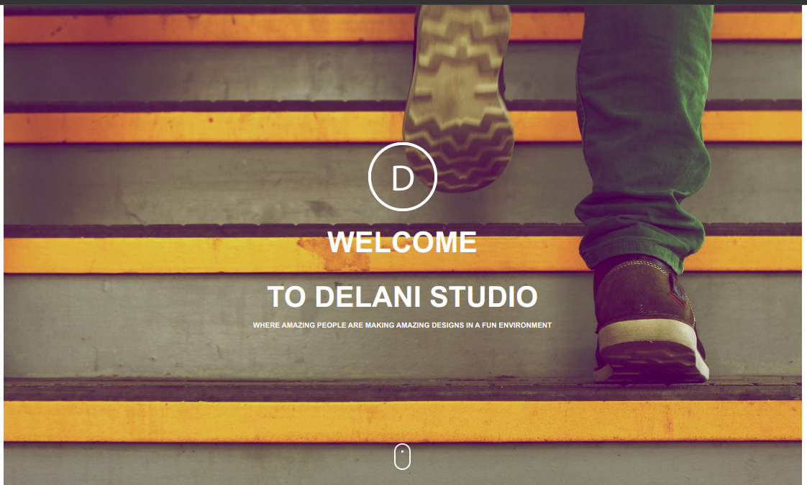
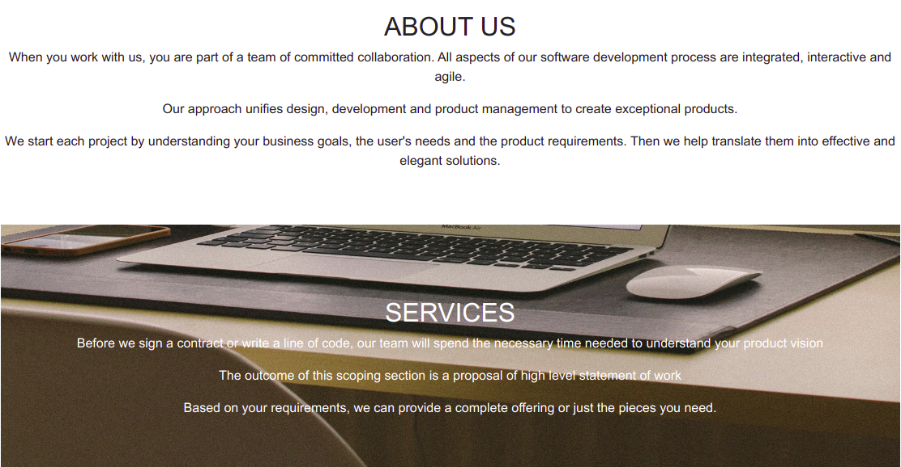
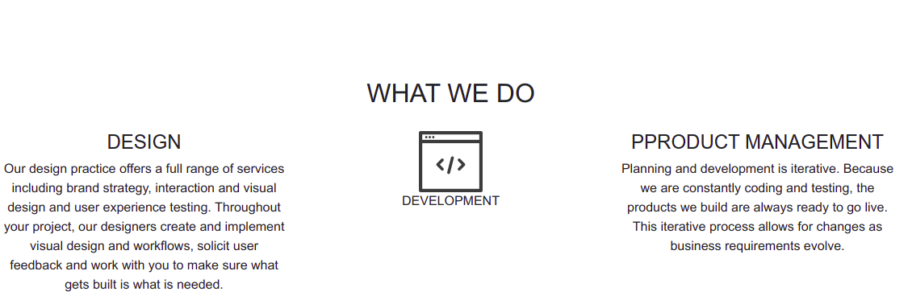
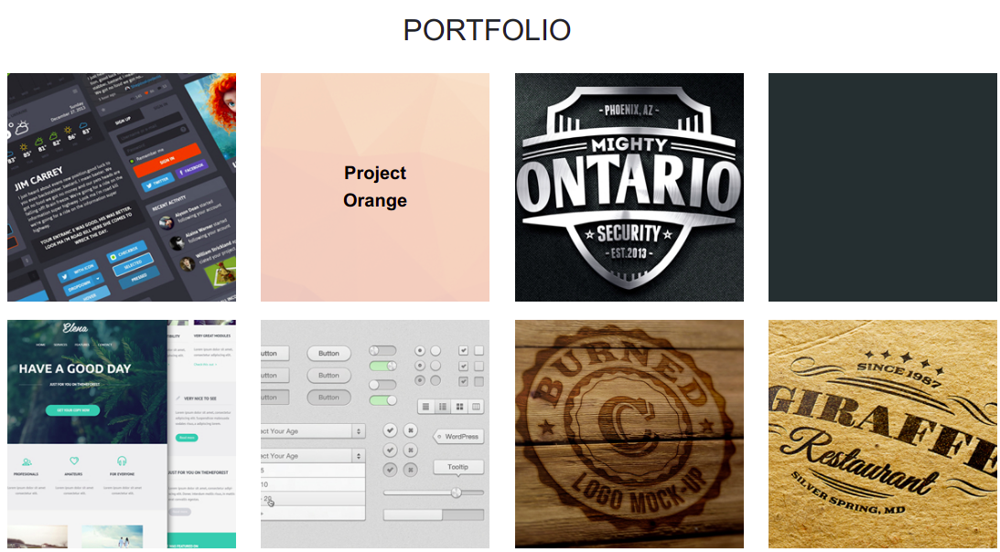

# DELANI STUDIO

  <h3 align="center">DELANI STUDIO</h3>
  

    This is a rework of the Delani Studio website as presented on the Moringa canvas assignments page.
     
    <a href="https://fltoki.github.io/IP3">View Demo</a>
    ·
    <a href="#">Report Bug</a>
    ·
    <a href="#">Request Feature</a>
  

  
   

      
TABLE OF CONTENTS

      <ol>
        <li>
          <a href="#about-the-project">About The Project</a>
          <ul>
            <li><a href="#built-using">Built Using</a></li>
          </ul>
        </li>
        <li><a href="#Navigating">Navigating</a></li>
        <li><a href="#license">License</a></li>
        <li><a href="#contact">Contact</a></li>
      </ol>
    

## Author
Built by: Musyoki Jim.

## About The Project

This is a rework of the Delani Studio website. It contains various technologies learnt through out the week meeting all the requirements listed on the page.

### Built Using
I used the following resources in its development
* [Bootstrap](https://getbootstrap.com)
* [JAVASCRIPT](https://javascript.com)
* [HTML](https://html.com)
* [CSS](https://css.com)

# Navigating

The first section lets you learn more about our policies, methods and strategies.

  

The website helps you learn more about what goes on at Delani Studio. The What We Do section contains information about how we go about the process of making the best application for you. To read more, click on the icons.

  

In the portfolio section, you can preview some of our projects, just hover over the images to get a clickable title that redirects you to the previews.

  

# License
Distributed under the MIT License. See `LICENSE` for more information.

## Contact
* Jim Musyoki - [Email:](https://musyokijim@gmail.com)
* Project Link: [Portfolio link](https://fltoki.github.io/ageProject)
